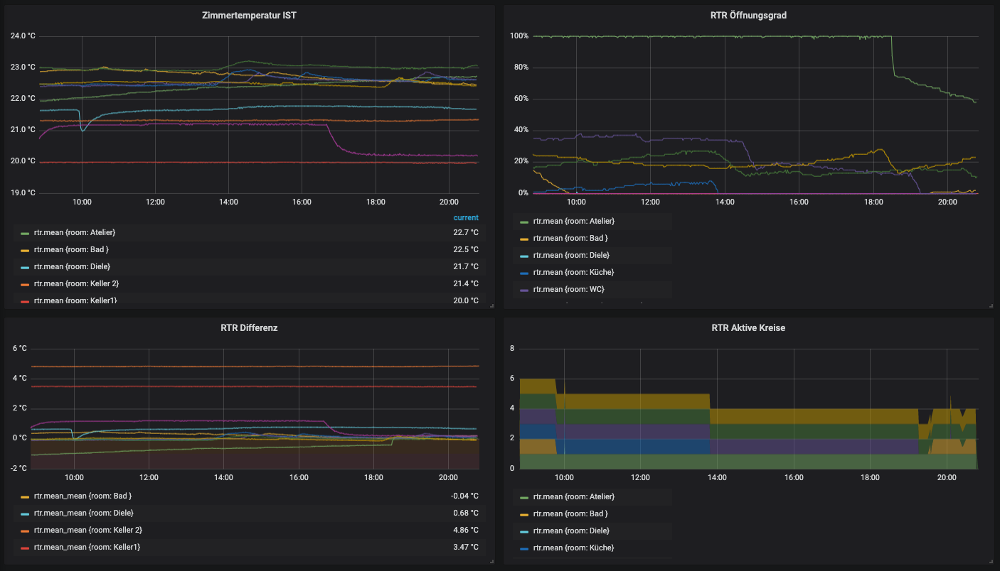
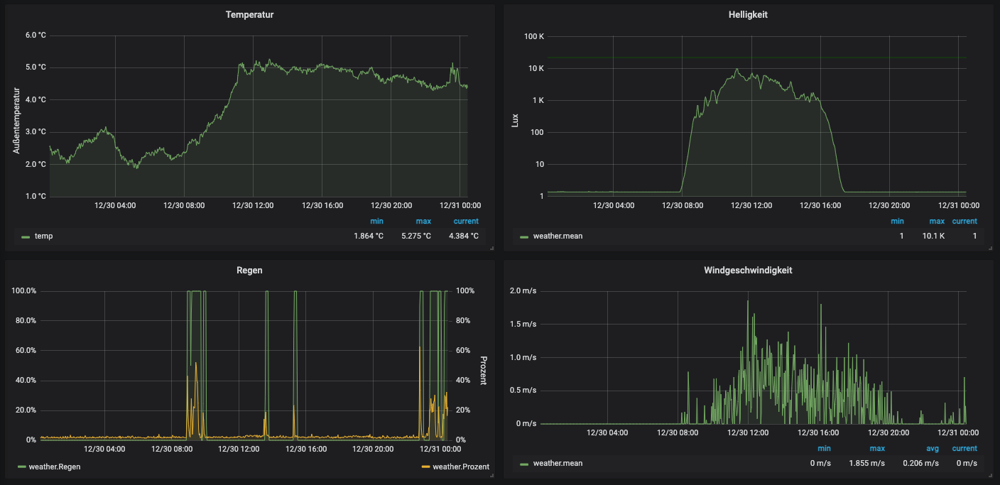

# Tools for free@home API (Smart Home System from ABB)

Based on [guckykv/freeathome-go-fahapi](https://github.com/guckykv/freeathome-go-fahapi)
this repository provides you with tools for working with the local API
of the [System Access Point 2.0 für Busch-free@home®](https://www.busch-jaeger.de/produktuebersicht?tx_nlbjproducts_catalog%5Baction%5D=show&tx_nlbjproducts_catalog%5BcatBjeProdukt%5D=42725&tx_nlbjproducts_catalog%5Bcontroller%5D=CatStdArtikel&cHash=8d65a7aae202e11a72f70d11ebc364d2)
(needs at least Access Point Software Version 2.6).

## Installation

Clone this repository, install locally at least Go 1.15, call `make all` or,
if you want to use the tools on your raspberry pi `make all-pi`.

Than you get two commands `cmd/fahcli/fahcli` and `cmd/fahinflux/fahinflux`.
Or for the raspberry pi `cmd/fahcli/fahcli-pi` and `cmd/fahinflux/fahinflux-pi`.

Create a config file `.fahapi-config.json`. See the [template](.fahapi-config-TEMPLATE.json)
and put it in your homedir.

---

## fahinflux - Writes all Updates for some Device Types into an InfluxDB

Writes all updates of all RTC, weather station and window sensors to InfluxDB.

Two examples of Grafana dashboards using data persisted by this command:

Room Temperature Controller | Weather Station
----|----
 | 

---

See [fahinflux](./cmd/fahinflux).

## fahcli - Manage devices via shell command

Very first version of a shell command to make all sorts of operations possible via the f@h API.

See [fahcli](./cmd/fahcli).

---

## fahvswitch - Example program for handling virtual devices

Small testprogramm for dealing with virtual devices.
The fahvswitch can be used to get all input messages for a virtual switch actuator and send the value back as output message.
So that the state will be shown correctly at the SysAP.

See [fahvswitch](./cmd/fahvswitch).

