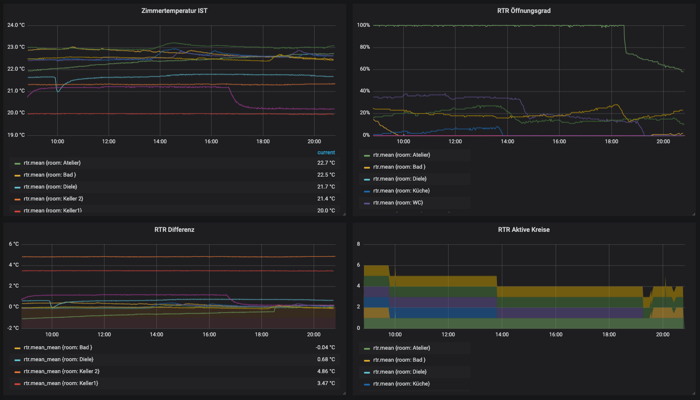
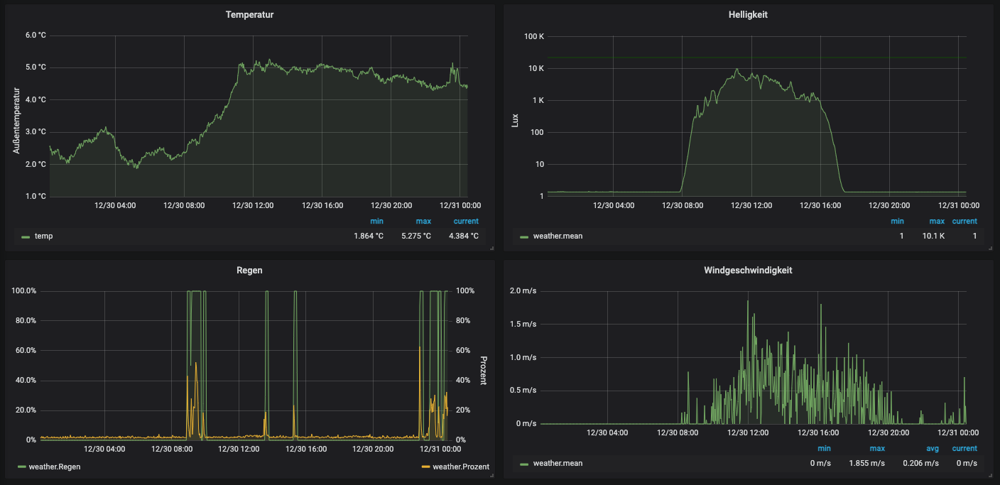

# Tools for free@home API (Smart Home System from ABB)

Based on [guckykv/freeathome-go-fahapi](https://github.com/guckykv/freeathome-go-fahapi)
this repository provides you with tools for working with the local API
of the [System Access Point 2.0 für Busch-free@home®](https://www.busch-jaeger.de/produktuebersicht?tx_nlbjproducts_catalog%5Baction%5D=show&tx_nlbjproducts_catalog%5BcatBjeProdukt%5D=42725&tx_nlbjproducts_catalog%5Bcontroller%5D=CatStdArtikel&cHash=8d65a7aae202e11a72f70d11ebc364d2)
(needs at least Access Point Software Version 2.6).

## Installation

Clone this repository and run `make all`. The binaries land next to their sources,
as `cmd/fahcli/fahcli` and so on. For a Raspberry Pi cross-compile with `make all-pi`
(32-bit) or `make all-pi64` (64-bit); those get a `-pi` resp. `-pi64` suffix.

`make check` runs gofmt, vet, build and tests before you commit.

Create a config file `.fahapi-config.json` in your home directory. See the
[template](.fahapi-config-TEMPLATE.json). Every tool reads the same file and ignores the
keys it does not need.

## Running as a service

`fahinflux` and `fahvswitch` are daemons; the others are one-shot commands.

| Signal | Effect |
| --- | --- |
| `SIGTERM`, `SIGINT` | Shut down: close the websocket, flush pending InfluxDB writes, exit 0 |
| `SIGHUP` | Report every unit as updated, so all current values are written |

A daemon does not exit when the connection drops — it reconnects with a backoff of up to
a minute. So `Restart=on-failure` will rarely fire; use `Restart=always` if you want a
crash covered.

```ini
[Service]
ExecStart=/home/pi/fahinflux
Restart=always
RestartSec=10
KillSignal=SIGTERM
TimeoutStopSec=20
```

Run **one** instance per SysAP. Several are served fine, but each is a client of an
access point that other software talks to as well.

---

## fahinflux - Writes all Updates for some Device Types into an InfluxDB

Writes all updates of all RTC, weather station and window sensors to InfluxDB.

Two examples of Grafana dashboards using data persisted by this command:

Room Temperature Controller | Weather Station
----|----
 | 

---

See [fahinflux](./cmd/fahinflux).

## fahcli - Manage devices via shell command

Very first version of a shell command to make all sorts of operations possible via the f@h API.

See [fahcli](./cmd/fahcli).

---

## fahvswitch - Example program for handling virtual devices

Small testprogramm for dealing with virtual devices.
The fahvswitch can be used to get all input messages for a virtual switch actuator and send the value back as output message.
So that the state will be shown correctly at the SysAP.

See [fahvswitch](./cmd/fahvswitch).

## sysapprobe - Measure how the SysAP treats websocket clients

A diagnostic tool, not a daemon. It speaks the websocket protocol directly to find
out which keepalive the System Access Point tolerates, how many connections it
serves at once, and how long a handshake takes. Worth running after a firmware
update, because the fahapi library builds on the answers.

One finding is worth repeating here: **a single text frame on the websocket
disconnects every client of the SysAP**, the free@home app included -- not just
the sender. Ping frames are answered reliably. The modes that send a text frame
therefore refuse to run without `-disruptive`.

See [sysapprobe](cmd/sysapprobe/README.md) for the measurements against software 2.6.
